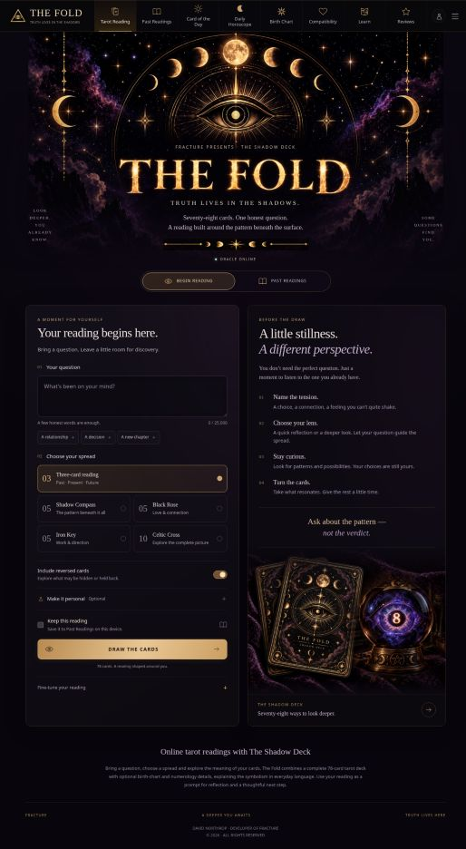
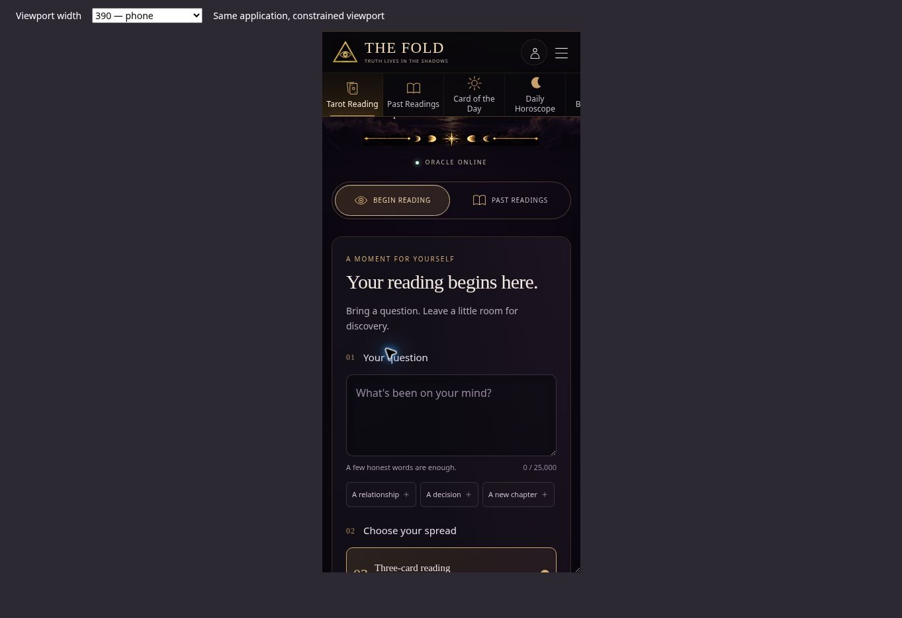

# The Fold — design refinement

September 8, 2026. Continues the navigation and crystal-ball work in pull request #29.

## Direction and references

Preserve The Fold's celestial eye, Shadow Deck, violet atmosphere, black surfaces, and warm gold. Give the reading itself clearer hierarchy and more space.

- [Labyrinthos](https://labyrinthos.co/) groups learning resources, card meanings, and spreads into explicit destinations. Applied here as visible spread choices with card counts and descriptions, plus direct access to the full deck.
- [CHANI](https://www.chani.com/) gives daily horoscopes and introductory astrology clear entry points. Applied here as distinct navigation destinations, concise guidance, and shorter headers when using a tool or visiting another section.

These are interaction and organization references. The Fold retains its own artwork and original interface copy.

## Changes

- Refined the full-width black-and-gold navigation, active state, outline icons, responsive scrolling, and keyboard-accessible menu.
- Kept the supplied crystal-ball photograph beside the Shadow Deck, with softer edges and a caption linking to the full deck.
- Replaced the spread dropdown with five accessible radio choices using the existing spread IDs.
- Added optional question prompts that disappear once the visitor writes a question.
- Grouped optional personal details and retained reversed cards, saved readings, gender, birth-chart details, focus, need, and profile memory.
- Removed autofocus on arrival, respected reduced-motion preferences, and added a skip-to-content link.
- Kept the profile button and Compatibility's birth-date prompt connected to the newly collapsible personal-details section.

## Verification

- Production client build and whitespace validation passed; the build still emits all six public pages and SEO files.
- Browser review at desktop size and 320, 390, 768, and 1024-pixel iframe widths. No horizontal document overflow observed at the measured 320, 768, and 1024 widths. The navigation scrolls within its own row on narrow screens.
- Tested a question prompt, five-card Shadow Compass selection, optional personal details, reading submission, and all-card reveal through to the rendered interpretation. Used synthetic input and left saving unchecked.
- Tested menu opening, Escape dismissal, daily horoscope navigation, Card of the Day from a different section, and Compatibility's return to the birth-date field.
- All three in-page image elements loaded successfully.
- Browser preview initially exposed the existing CommonJS astronomy adapter directly, which prevented rendering. Vite now aliases that adapter to the installed package's ESM browser entry. The server adapter, package versions, and calculation source remain intact. [Vite alias configuration](https://vite.dev/config/shared-options.html#resolve-alias).

No production deployment is part of this review update.

## Review images

Desktop overview:

Phone-width reading form (local responsive QA frame):

